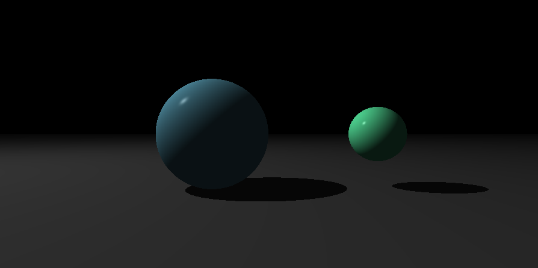

[](https://github.com/nfauconn/miniRT/blob/master/README.md)
[](https://github.com/nfauconn/miniRT/blob/master/README.fr.md)

*Langage de programmation C* • *Rendu graphique 3D* • *Calculs géométriques* • *Programmation graphique* • *Éclairage et ombrage* • *Gestion des données* • *Analyse et I/O de fichiers* • *Utilisation de la bibliothèque mathématique* • *Gestion de la mémoire* • *Gestion des erreurs et validation* • *Makefile et compilation* • *Tests unitaires et debug avec Criterion*

# MiniRT

Le but du programme est de générer des images en utilisant le protocole de Raytracing. Ces images générées par ordinateur représenteront chacune une scène, vue d'un angle et d'une position spécifiques, définis par des objets géométriques simples, et chacune avec son propre système d'éclairage.

> Pour la gestion de l'affichage graphique et la manipulation des fenêtres, ce projet utilise la bibliothèque graphique `minilibX`. Cette bibliothèque, spécifiquement développée pour les étudiants de l'École 42, offre une interface simple pour créer des fenêtres graphiques et gérer les événements clavier/souris.

| Clé | Valeur |
|--|--|
Nom du programme | miniRT |
Langage | C
Fichiers à rendre | `Makefile`, `*.h`, `*.c`
Makefile  | `NAME`, `all`, `clean`, `fclean`, `re` 
Arguments | une scène au format `*.rt`
Fonct. externes | `open`, `close`, `read`, `write`, `printf`, `malloc`, `free`, `perror`, `strerror`, `exit` - toutes les fonctions de la bibliothèque de mathématiques (`-lm man man 3 math`) - toutes les fonctions de la MinilibX
Variables globales | Aucune

## Utilisation

```shell
git clone git@github.com:nfauconn/miniRT.git
cd miniRT/Projet
make
```

```shell
./miniRT <scene.rt>
```

Des exemples de scènes se trouvent dans `scenes/`




Si vous souhaitez changer le ratio, vous pouvez modifier les valeurs `WIDTH` et `HEIGHT` dans `includes/miniRT.h`

Si vous souhaitez créer votre propre scène, voici les spécifications :

- Chaque type d'élément peut être séparé par un ou plusieurs sauts de ligne.
- Chaque type d'information d'un élément peut être séparé par un ou plusieurs espaces.
- Chaque type d'élément peut être mis dans n'importe quel ordre dans le fichier.
- Les lumières, sphères, cylindres et plans peuvent être multiples.

- La première information de chaque élément est l'identifiant du type (composé d'un ou deux caractères), suivi de toutes les informations spécifiques à chaque objet dans un ordre strict comme suit :
- **Éclairage ambiant** :
	```
	A	0.2		255,255,255
	```
	- identifiant : A
	- ratio d'éclairage ambiant dans l'intervalle [0,1] : 0.2
	- Couleurs R,G,B dans l'intervalle [0-255] : 255, 255, 255
- **Caméra** :
	```
	C	-50,0,20	0,0,1	70
	```
	- identifiant : C
	- coordonnées x,y,z du point de vue : -50,0,20
	- vecteur d'orientation normalisé 3D. Dans l'intervalle [-1,1] pour chaque axe x,y,z : 0,0,1
    - FOV : Champ de vision horizontal en degrés dans l'intervalle [0,180] : 70
- **Lumière** :
	```
	L	-40,50,0	0.6		10,0,255
	```
	- identifiant : L
	- coordonnées x,y,z du point lumineux : -40,50,0
	- ratio de luminosité de la lumière dans l'intervalle [0,1] : 0.6
	- Couleurs R,G,B dans l'intervalle [

0-255] : 10, 0, 255
- **Sphère** :
	```
	sp	0,0,20.6	12.6	10,0,255
	```
	- identifiant : sp
	- coordonnées x,y,z du centre de la sphère : 0,0,20.6
	- diamètre de la sphère : 12.6
	- Couleurs R,G,B dans l'intervalle [0-255] : 10, 0, 255
- **Plan** :
	```
	pl	0,0,-10	0,1,0	0,0,225
	```
	- identifiant : pl
	- coordonnées x,y,z d'un point dans le plan : 0,0,-10
	- vecteur normal normalisé 3D. Dans l'intervalle [-1,1] pour chaque axe x,y,z : 0,1,0
	- Couleurs R,G,B dans l'intervalle [0-255] : 0,0,225
- **Cylindre** :
	```
	cy	50,0,20.6	0,0,1	14.2	21.42	10,0,255
	```
	- identifiant : cy
	- coordonnées x,y,z du centre du cylindre : 50,0,20.6
	- vecteur d'axe normalisé 3D du cylindre. Dans l'intervalle [-1,1] pour chaque axe x,y,z : 0,0,1
	- diamètre du cylindre : 14.2
	- hauteur du cylindre : 21.42
	- Couleurs R,G,B dans l'intervalle [0,255] : 10, 0, 255

### Tests unitaires Criterion

*Prérequis :* le paquet `criterion`. Vous pouvez également [le construire à partir des sources](https://criterion.readthedocs.io/en/master/setup.html).

```shell
cd miniRT/Projet
make tests
```