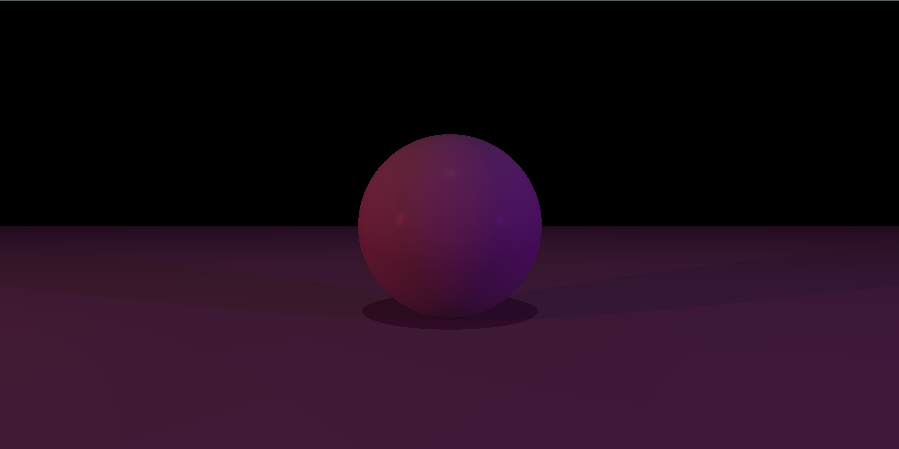
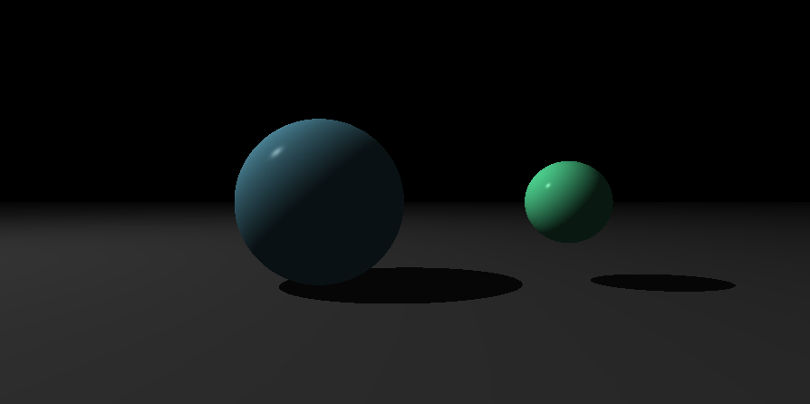

[](https://github.com/nfauconn/miniRT/blob/master/README.md)
[](https://github.com/nfauconn/miniRT/blob/master/README.fr.md)

# MiniRT

The goal of the program is to generate images using the Raytracing protocol. Those computer-generated images will each represent a scene, as seen from a specific angle and position, defined by simple geometric objects, and each with its own lighting system.

## Usage

```shell
git clone git@github.com:nfauconn/miniRT.git
cd miniRT/Project
make
```

```shell
./miniRT <scene.rt>
```

Scenes examples are located in `scenes/`





If you want to change the ratio, you can change the `WIDTH` and `HEIGHT` values in `includes/miniRT.h`

If you want to create your own scene, here are the specifications:

- Each type of element can be separated by one or more line break(s).
- Each type of information from an element can be separated by one or more space(s).
- Each type of element can be set in any order in the file.
- Lights, Spheres, Cylinders and Planes can be multiple.

- Each element first’s information is the type identifier (composed by one or two character(s)), followed by all specific information for each object in a strict order such as:
- **Ambient lightning**:
	```
	A	0.2		255,255,255
	```
	- identifier: A
	- ambient lighting ratio in range [0,1]: 0.2
	- R,G,B colors in range [0-255]: 255, 255, 255
- **Camera**:
	```
	C	-50,0,20	0,0,1	70
	```
	- identifier: C
	- x,y,z coordinates of the view point: -50,0,20
	- 3D normalized orientation vector. In range [-1,1] for each x,y,z axis: 0,0,1
       - FOV : Horizontal field of view in degrees in range [0,180]: 70
- **Light:**
	```
	L	-40,50,0	0.6		10,0,255
	```
	- identifier: L
	- x,y,z coordinates of the light point: -40,50,0
	- the light brightness ratio in range [0,1]: 0.6
	- R,G,B colors in range [0-255]: 10, 0, 255
- **Sphere**:
	```
	sp	0,0,20.6	12.6	10,0,255
	```
	- identifier: sp
	- x,y,z coordinates of the sphere center: 0,0,20.6
	- the sphere diameter: 12.6
	- R,G,B colors in range [0-255]: 10, 0, 255
- **Plane:**
	```
	pl	0,0,-10	0,1,0	0,0,225
	```
	- identifier: pl
	- x,y,z coordinates of a point in the plane: 0,0,-10
	- 3D normalized normal vector. In range [-1,1] for each x,y,z axis: 0,1,0
	- R,G,B colors in range [0-255]: 0,0,225
- **Cylinder:**
	```
	cy	50,0,20.6	0,0,1	14.2	21.42	10,0,255
	```
	- identifier: cy
	- x,y,z coordinates of the center of the cylinder: 50,0,20.6
	- 3D normalized vector of axis of cylinder. In range [-1,1] for each x,y,z axis:
	0,0,1
	- the cylinder diameter: 14.2
	- the cylinder height: 21.42
	- R,G,B colors in range [0,255]: 10, 0, 255


## Description

| Program name | miniRT |
|--|--|
Language | C
Turn in files | `Makefile`, `*.h`, `*.c`
Makefile  | `NAME`, `all`, `clean`, `fclean`, `re` 
Arguments | a scene in format `*.rt`
External functs. | `open`, `close`, `read`, `write`, `printf`, `malloc`, `free`, `perror`, `strerror`, `exit` - all functions of the math library (`-lm man man 3 math`) - all functions of the MinilibX

### Graphics Library

For graphical display management and window manipulation, this project utilizes the `minilibX` graphics library. This library, specifically developed for students at École 42, offers a straightforward interface for creating graphic windows and managing keyboard/mouse events.

## Skills

- **3D Graphics Rendering**:
   - Fundamentals of ray tracing for generating realistic images
   - The Phong reflection model for realistic lighting and shading

- **Geometric Computation**:
   - Mathematical concepts of geometry and linear algebra
   - Geometric transformations such as translation and rotation using matrices

- **Graphics Programming**:
   - Graphic librarie (miniLibX) to create and manage windows
   - Pixel manipulation to render images on the screen

- **Lighting and Shading**:
   - Different lighting models, including ambient, diffuse, and specular lighting
   - Multiple light sources and colored lighting to enhance realism

- **Data Management**:
   - Organized data structures to represent 3D objects, lights, and cameras

- **Parsing and File I/O**:
   - Scene description files parsing
   - I/O operations to read scene configurations and manage errors

- **Math Library Utilization**:
    - Proficiency in utilizing math library functions for complex mathematical operations and transformations

- **Memory Management**:
   - In-depth understanding of dynamic memory allocation and deallocation
   - Ability to manage memory efficiently and prevent leaks in a complex application

- **Error Handling and Validation**:
   - Error handling and meaningful error messages
   - Validating and sanitizing input data to ensure the stability of the application

- **Makefile and Compilation**:
   - Project compilation, cleaning, and recompilation
   - No relinkage of object files

- **Unit Testing and Debugging**:
    - Writing and maintaining unit tests through the whole building of the project using Criterion for robust and reliable code
    - Debugging complex systems and ensuring the correctness of the implementation